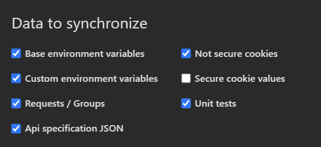
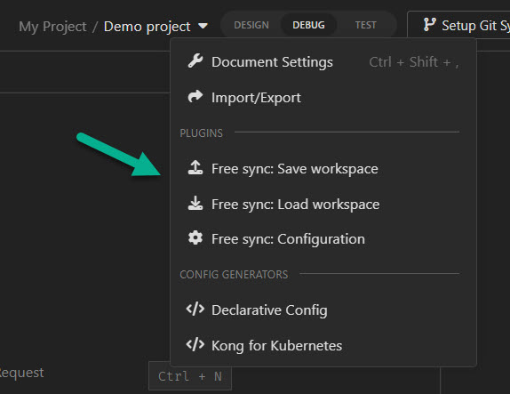

#  Free sync - plugin for [Insomnia](https://insomnia.rest/)

If you like this plugin, [leave it a :star: on Github!](https://github.com/NickRimmer/insomnia-plugin-free-sync)

## Overview

This plugin use internal Insomnia methods to Import/Export workspaces as a JSON file. Additionally plugin allows to
configure what should be synchronized.

### Installation

You can find the plugin at this [link](https://insomnia.rest/plugins/insomnia-plugin-free-sync).

### How to use it

- Install the plugin from the [Insomnia plugin Hub](https://insomnia.rest/plugins/insomnia-plugin-free-sync).
- Open workspace menu and select `Free sync: Configuration`
- When file path is configured, workspace can be synchronized with `Save workspace` / `Load workspace` workspace options

Contributions, issues and feature requests are welcome. Feel free to open
an [issue](https://github.com/NickRimmer/insomnia-plugin-free-sync/issues) or create
a [pull request](https://github.com/NickRimmer/insomnia-plugin-free-sync/pulls).
